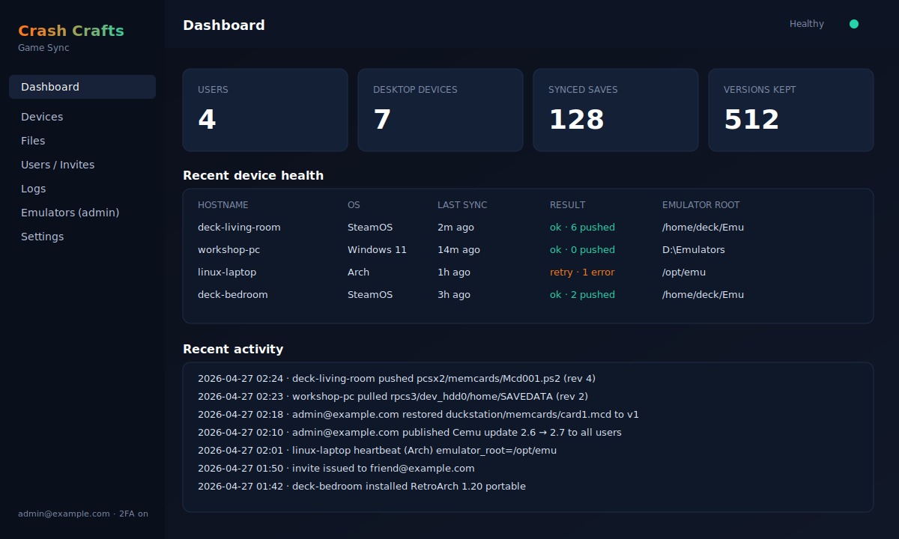
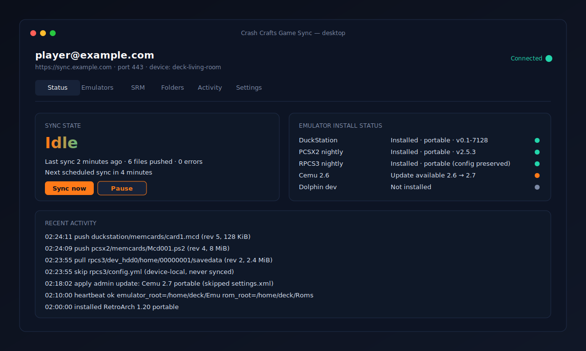
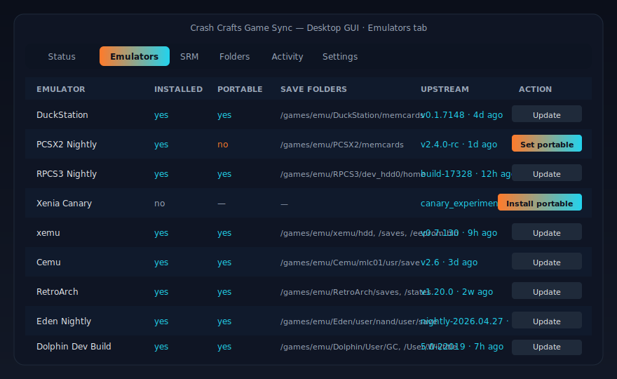

# Crash Crafts Game Sync

Crash Crafts Game Sync is an emulator save backup and synchronization platform for Windows, Linux, and Steam Deck. A single Docker container hosts the server, Web UI, and (optionally) the canonical portable emulator bundles. Desktop clients install as a real GUI application that looks and behaves like OneDrive — tray status, sync state, folder pickers, and an installer for the supported emulators and Steam ROM Manager.

## Screenshots

### Docker Web UI — management dashboard (port `8080`)



### Docker Web UI — file versions with non-destructive Restore



### Desktop GUI — OneDrive-style status window



### Reference




## Features

### Docker server + Web UI

- First-run setup wizard — admin account, required TOTP 2FA, Office365 OAuth SMTP metadata, and uploaded logo, all stored in the `/data` volume.
- Multi-view single-page Web UI served from `/`: Login, Dashboard, Devices, Files, Users / Invites, Logs, Settings, and Emulators (admin).
- **File version history with one-click Restore.** Restoring an older version snapshots the current file as a new version first, so newer versions are preserved and the revert can itself be undone.
- Versioned save storage (current copy plus retained older copies, configurable retention).
- Device registry — each desktop sends `POST /api/devices/heartbeat` with hostname, OS, configured emulator/ROM roots, and last-sync result; the dashboard surfaces every device's health.
- Server-side client log viewer (admin).
- Admin-managed users, invite-based registration with TOTP enrollment, user disable.
- **Single-button "update all emulators" admin flow.** The admin clicks one button; the server queries each emulator's official release source, lists which emulators have updates, lets the admin select or skip per-emulator, then publishes the new bundle to every user. Desktops pick up the new bundle on their next sync — config files (controllers, GPU backend, RPCS3 device config, etc.) are never overwritten.
- Per-OS emulator manifest — separate Linux and Windows download URLs and SHA-256 checksums for DuckStation, PCSX2 nightly, RPCS3 nightly, Xenia Canary, xemu, Cemu, RetroArch, Eden nightly, and Dolphin dev. Cross-OS save sync is supported (a save pushed from Linux pulls cleanly on Windows and vice versa, verified by a round-trip integration test).
- Tightened Content-Security-Policy — no inline scripts; the SPA is served as a single `/static/app.js`.
- Read-only root filesystem, dropped capabilities, `no-new-privileges`, healthcheck, and restrictive on-disk permissions for at-rest data.

### Desktop GUI (Windows + Linux + Steam Deck)

- **OneDrive-style window**: header with account email, server URL, port, and connection-status dot; tray-style status panel with current state (Idle / Syncing / Error), last sync time, files queued, and "Sync now" / "Pause" buttons.
- **Tabs**: Status, Emulators, SRM, Folders, Activity, Settings.
- **Auto-detection** of installed emulators and their save locations for DuckStation, PCSX2, RPCS3, Xenia Canary, xemu, Cemu, RetroArch, Eden, and Dolphin (dev).
- **Portable mode by default** — the GUI installs each supported emulator into the configured emulator root and switches it to portable mode automatically. RPCS3 is treated specially: its device config file is preserved on every update so emulator/controller settings are never broken.
- **Server-driven emulator updates** — once the admin publishes a new bundle, every desktop downloads it from the server (not the vendor) and applies it without touching device-local config files.
- **Native folder pickers** for the emulator install root and the ROM library root (multiple roots supported).
- **First-run wizard**: enter the Docker server URL (HTTPS by default — the desktop talks to the server over **port 443**), paste invite token, choose emulator root, choose ROM root, choose which emulators to install, install Steam ROM Manager, generate parsers, enable autostart.
- **Steam ROM Manager integration** — install SRM, generate parser presets per installed emulator, see status per parser.
- **Activity log tab** with "Open log file" button.
- The GUI process embeds the sync engine and writes the same `desktop-config.json` used by the headless daemon, so a background service keeps syncing even when the GUI is closed.

### Steam Deck (Decky Loader plugin)

- Game-mode mini-UI that calls the local daemon's status endpoint.
- Mirrors the desktop GUI's status panel (read-only): sync state, last sync, last error.
- Works across all SteamOS install variants — the plugin talks to the local daemon over `127.0.0.1`, so it does not care whether the daemon was installed via the Linux tarball, `.deb`, `.rpm`, AUR `PKGBUILD`, or directly via `cargo install`.

### Packaging

- **Linux**: tarball, `.deb`, `.rpm`, AUR `PKGBUILD`. Each ships both binaries (`crash-crafts-game-sync` daemon + `crash-crafts-game-sync-gui` GUI), a `.desktop` launcher, an icon under `/usr/share/icons/hicolor/`, and a systemd user unit for the headless daemon.
- **Windows**: MSI installs the GUI as the Start Menu shortcut, the daemon as the `CrashCraftsGameSync` Windows Service, and an autostart shortcut for the GUI in the user's Startup folder.
- **Steam Deck**: Decky Loader plugin manifest in `packaging/steam-deck/decky-plugin/`.

### Sync correctness guarantees

- Manifest-driven include/exclude rules — only manifest-approved save files are pushed/pulled. Verified by `push_pull_round_trip_syncs_only_manifest_approved_files_across_devices`, which boots the real server in-process, pushes a save from one device, pulls it into a second device, asserts byte-identical content, and asserts that controller/emulator config files were **not** synced.
- RPCS3 device config (`config.yml`, controller bindings) is explicitly excluded from sync and from server-pushed emulator updates. Verified by `extract_bundle_skips_device_local_config_files_on_update_for_rpcs3`.
- Restoring an older version is non-destructive. Verified by `restore_file_version_promotes_chosen_bytes_and_preserves_newer_versions`.

## Setup

### 1. Run the Docker server

```bash
docker compose up --build
```

…or pre-pull the published image:

```bash
docker pull ghcr.io/crashmediait/gcmgamesync:latest
docker compose up
```

The container listens on **port `8080` inside the container**, mapped to **`8080` on the host** by `docker-compose.yml`. Persistent state (setup, users, invites, sessions, files, versions, uploaded logo, emulator bundles) lives in the `crash-crafts-game-sync-data` Docker volume mounted at `/data`.

Open <http://localhost:8080> in a browser and complete the first-run setup page (admin email + password, TOTP enrollment, optional Office365 SMTP for invite emails, optional logo upload).

### 2. Put the server behind HTTPS

Desktops require HTTPS for any non-localhost server URL — they will refuse to connect to a plain `http://` server unless it targets `localhost`/`127.0.0.1`. Run the container behind any HTTPS reverse proxy (Caddy, nginx, Traefik, Cloudflare Tunnel, …) and publish it on **port 443** (the default for `https://`).

The desktop GUI reaches the server using the URL you enter during the first-run wizard, e.g. `https://sync.example.com` — because the URL uses `https://`, port `443` is implied and used automatically; you do not need to type a port number.

### 3. Invite users

In the Web UI, open **Users / Invites** → *Create invite*. Send the invite token to the user. They paste it into the desktop GUI's first-run wizard (or `cargo run -- register --invite <token>` for headless installs), set a password, and complete TOTP enrollment.

### 4. Install the desktop GUI

- **Windows**: install the MSI from the latest GitHub release. The MSI installs the GUI in the Start Menu, registers the headless daemon as the `CrashCraftsGameSync` service, and adds a Startup shortcut for the GUI.
- **Linux (Debian/Ubuntu)**: install the `.deb`. `.desktop` entry appears in the application menu, and the daemon runs as a user systemd unit.
- **Linux (Fedora/RHEL/openSUSE)**: install the `.rpm`.
- **Linux (Arch)**: build from the AUR `PKGBUILD`.
- **Steam Deck game mode**: install the Decky Loader plugin from `packaging/steam-deck/decky-plugin/`.

Launch the GUI and the first-run wizard walks you through:

1. **Server URL** (`https://your-server`).
2. **Invite token** paste box.
3. **Emulator install root** (folder picker).
4. **ROM library root** (folder picker, multiple roots supported).
5. **Which emulators to install** (checklist) — the GUI downloads each from the server's published bundle and switches it to portable mode automatically. RPCS3's device config file is preserved.
6. **Install Steam ROM Manager + generate parsers** (checkboxes).
7. **Enable autostart**.

### 5. Push emulator updates to all users (admin)

In the Web UI, open **Emulators (admin)** and click **Update all emulators**. The server fetches the current versions for every emulator (DuckStation, PCSX2 nightly, RPCS3 nightly, Xenia Canary, xemu, Cemu, RetroArch, Eden nightly, Dolphin dev) and shows you which have a new version. Tick the ones you want to publish, click **Apply**, and every desktop picks up the new bundle on its next sync. Device-local config files are never touched.

### 6. Restore a save (Web UI)

**Files** view → click **Versions** next to any synced save → click **Restore** next to the version you want. The current live file is snapshotted as a new version first, then the chosen historical content becomes the new live file. No newer versions are deleted — the revert can itself be reverted.

## SMTP — Office365 / Microsoft 365 OAuth2 setup

The first-run wizard collects the credentials needed to send invite emails through Microsoft 365 (`smtp.office365.com`) using OAuth2 instead of a stored password — Microsoft has been disabling Basic Auth for SMTP, so OAuth2 is the supported path.

The setup form asks for three values:

| Field | Where to find it |
|---|---|
| **Office365 tenant ID** | Microsoft Entra admin center → *Overview* → *Directory (tenant) ID* (a GUID). |
| **Office365 OAuth client ID** | The Application (client) ID of the Entra app registration you create below (a GUID). |
| **SMTP from email** | The licensed Microsoft 365 mailbox that invites should be sent **from**. Must be a real mailbox in the same tenant. |

### One-time tenant configuration

1. **Register the application in Microsoft Entra ID** (formerly Azure AD).
   - <https://entra.microsoft.com> → **Applications** → **App registrations** → **New registration**.
   - Name: `Crash Crafts Game Sync` (any name is fine).
   - *Supported account types*: **Accounts in this organizational directory only (single tenant)**.
   - *Redirect URI*: leave empty for now (the app uses the OAuth2 device-code flow; no web redirect is required).
   - Click **Register**, then copy the **Application (client) ID** and **Directory (tenant) ID** from the *Overview* blade.
2. **Allow public-client / device-code flow.**
   - In the new app registration, go to **Authentication** → **Advanced settings** → set *Allow public client flows* to **Yes** → **Save**.
3. **Grant the SMTP send permission.**
   - **API permissions** → **Add a permission** → **APIs my organization uses** → search for **Office 365 Exchange Online** → **Delegated permissions** → tick **`SMTP.Send`** → **Add permissions**.
   - Click **Grant admin consent for <tenant>** and confirm.
4. **Enable Authenticated SMTP on the sending mailbox.**
   - <https://admin.microsoft.com> → **Users** → **Active users** → select the mailbox that matches *SMTP from email* → **Mail** tab → **Manage email apps** → tick **Authenticated SMTP** → **Save changes**.
   - Note: in some tenants this is also controlled by **Exchange admin center** → **Settings** → **Mail flow** → *Turn on/off SMTP AUTH*. If org-wide SMTP AUTH is disabled, leave it disabled and unblock just this mailbox.
5. **Confirm the mailbox is licensed** (Exchange Online plan or Microsoft 365 Business Standard/Premium / E1+). Shared mailboxes without a license cannot send via SMTP.

### Filling in the wizard

1. Open the Docker server and complete the first-run setup page.
2. Paste the **tenant ID** (GUID) and **client ID** (GUID).
3. Enter the **From email** — the licensed mailbox you enabled SMTP AUTH on.
4. Submit. The server stores `provider=office365`, `auth=oauth2`, `tenant_id`, `client_id`, and `from_email` in `/data/state.json`. No password or refresh token is ever stored in the container.

### Sending the first invite

When the admin issues the first invite from **Users / Invites → Create invite**, the server requests a token from Microsoft using the OAuth2 device-code flow. The first time this happens an admin user of the *from-email* mailbox will be prompted (in the server log) to visit `https://microsoft.com/devicelogin` and approve the app once. The acquired token is cached and refreshed automatically thereafter.

### Troubleshooting

- **`535 5.7.139 Authentication unsuccessful, SmtpClientAuthentication is disabled`** — Authenticated SMTP is off for the mailbox or for the tenant. Re-check step 4.
- **`AADSTS65001: The user or administrator has not consented to use the application`** — admin consent was not granted. Re-run **Grant admin consent** in step 3.
- **`AADSTS50059: No tenant-identifying information found`** — the tenant ID GUID was mistyped.
- **`The mailbox cannot be found`** — the *From email* must be an exact licensed mailbox in this tenant; aliases on a different domain are rejected.

## Web UI theme

Modern dark, glass-style UI with orange and cyan neon accents. The CSS lives in the binary alongside `static/app.js`, served with a strict CSP (`script-src 'self'`).

## Run without Docker

```bash
cargo run --bin crash-crafts-game-sync -- server [--host 127.0.0.1] [--port 8080] [--data-dir /data]
```

## Advanced / scripting (CLI)

The same binary that runs the server also exposes a CLI for headless installs and scripting:

```bash
cargo run -- companion
cargo run -- manifest
cargo run -- scan --root /path/to/emulators
cargo run -- status --root /path/to/emulators
cargo run -- desktop-config
cargo run -- setup-desktop --server https://sync.example.com --token <token> \
                           --rom-root /games/roms --emulator-root /games/emulators
cargo run -- daemon --once
cargo run -- generate-srm
cargo run -- healthcheck [--url http://127.0.0.1:8080/api/health]
```

The desktop config file lives at `~/.config/crash-crafts-game-sync/desktop-config.json` on Linux and `%APPDATA%\CrashCrafts\GameSync\desktop-config.json` on Windows. The GUI and the headless daemon share this file, so you can install the systemd/Windows service for background sync and use the GUI just as a status window.

## HTTP API

### Public

- `GET /api/health` — health check.
- `GET /api/config` — public Web UI setup/branding configuration.
- `GET /api/emulators` — shared emulator manifest (overlaid with admin-published per-OS URLs and SHA-256s).
- `GET /api/emulator-bundle/{id}` — download a server-hosted emulator bundle.
- `POST /api/setup` — first-run Docker setup.
- `POST /api/login` — `email`, `password`, `totp_code`.
- `POST /api/register` — invite-based registration; returns TOTP secret/provisioning URI.

### Authenticated

- `GET /api/me` — current user, role, 2FA state.
- `GET /api/stats` — dashboard counters (users, devices, files, versions, storage).
- `GET /api/devices` — registered desktop companions.
- `POST /api/devices/heartbeat` — desktop heartbeat (hostname, OS, roots, last-sync result).
- `GET /api/files` — list synced saves with size, version count, modified time.
- `GET /api/files/{path}` — download current live content.
- `PUT /api/files/{path}` — upload a save (creates a new version).
- `GET /api/files/{path}/versions` — list historical versions.
- `POST /api/files/{path}/versions/{version_name}/restore` — non-destructive restore: snapshots current as a new version and promotes the chosen one to live.
- `POST /api/logs` — upload a client log entry.
- `GET /api/logs` — paginated log viewer (admin).
- `GET /api/settings` — server settings.

### Admin

- `GET /api/users`, `POST /api/users/{email}/disable`.
- `GET /api/invites`, `POST /api/invites`.
- `POST /api/admin/logo` — upload logo.
- `GET /api/admin/emulators`, `POST /api/admin/emulators` — per-OS URL/SHA overlay.
- `PUT /api/admin/emulator-bundle/{id}` — upload a portable bundle to host on the server.
- `GET /api/admin/check-emulator-updates` — what's new upstream.
- `POST /api/admin/apply-emulator-update` — publish an update to all users.

### Local desktop GUI (loopback only)

The GUI binary binds a tiny HTTP server on `127.0.0.1` and opens the SPA in the user's default browser. Endpoints under `/api/local/*` (config, status, sync-now, pause, emulators, install-emulator, enable-portable, srm, install-srm, generate-srm, folders, activity, open) back the GUI tabs.

## Architecture & roadmap

- [`docs/ARCHITECTURE.md`](docs/ARCHITECTURE.md)
- [`docs/ROADMAP.md`](docs/ROADMAP.md)
