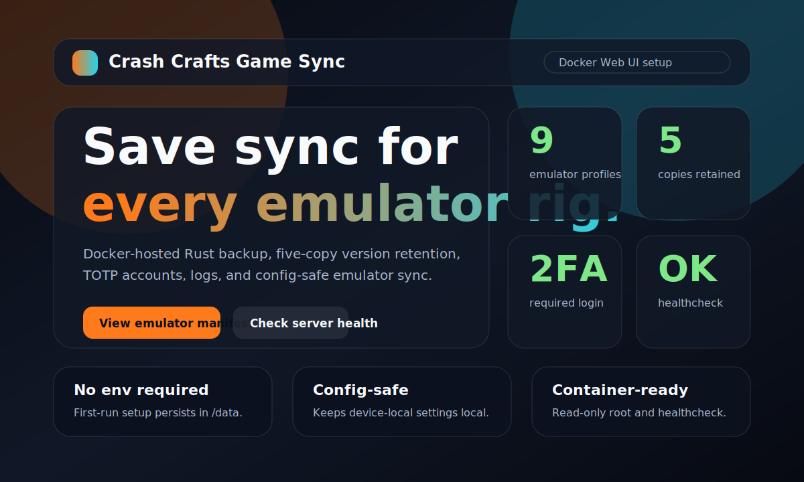
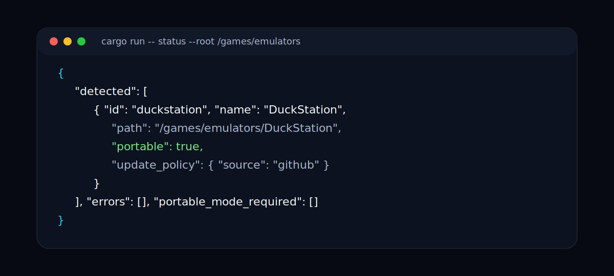
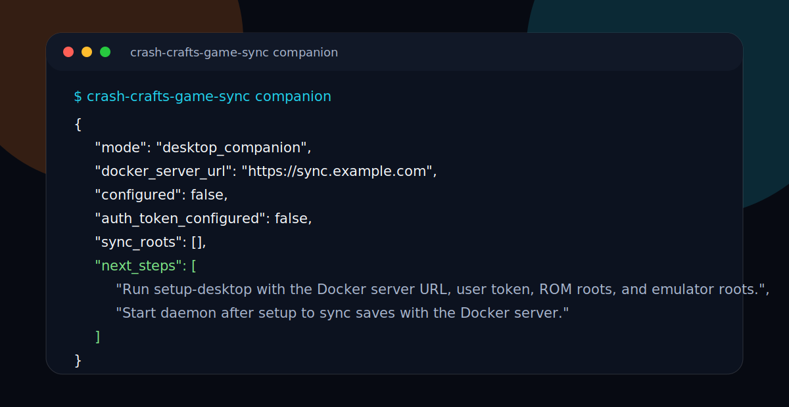
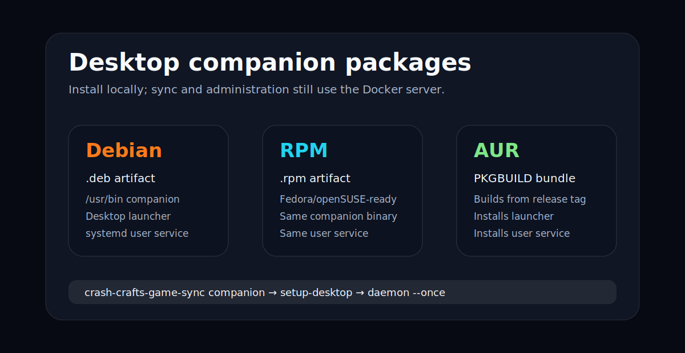

# Crash Crafts Game Sync

Crash Crafts Game Sync is an emulator save backup and synchronization platform. This PR focuses on the Docker-hosted Web UI setup flow, persistent server configuration, and secure-by-default container settings.

## Screenshots









## Goals

- Synchronize emulator saves across devices.
- Preserve five total copies of changed files, including the current copy.
- Keep gamepad, path, graphics, and other user/device configuration local to each device.
- Support admin-managed users, registration, required TOTP 2FA, server-side client logs, and emulator update metadata.
- Track DuckStation, PCSX2 nightly, RPCS3 nightly, Xenia Canary, xemu, Cemu, RetroArch, Eden nightly, and Dolphin dev builds.

## Run with Docker

```bash
docker compose up --build
```

To pre-pull the published image instead of building locally:

```bash
docker pull ghcr.io/crashmediait/gcmgamesync:latest
```

Open <http://localhost:8080> and complete the first-run setup page. The initial admin account, TOTP secret, Office365 OAuth SMTP metadata, and uploaded logo are stored in the Docker volume at `/data`; no Docker environment variables are required.

The image includes a built-in healthcheck that calls `/api/health`, and the Docker build context excludes local build outputs and repository metadata. The Compose service runs with a read-only root filesystem; persistent writes go to the `/data` volume and temporary writes are limited to the `/tmp` tmpfs.

For transit security, run the container behind an HTTPS reverse proxy before exposing it beyond localhost. At-rest state and uploaded synchronized files are written with restrictive file permissions on Unix-like hosts. A separate Postgres service is not required for the current Docker setup because the app stores its small setup/configuration state and versioned file metadata in the mounted `/data` volume.

## Web UI theme

The server root (`/`) includes a modern dark, glass-style UI with orange and cyan neon accents. I could not fetch `crashcrafts.com` from this sandbox to verify exact brand tokens, so the MVP uses a CrashCrafts-style high-contrast gaming palette that can be adjusted once official colors are available.

## Run without Docker

```bash
cargo run -- server
```

## Client MVP

```bash
cargo run -- companion
cargo run -- manifest
cargo run -- scan --root /path/to/emulators
cargo run -- status --root /path/to/emulators
cargo run -- desktop-config
cargo run -- setup-desktop --server https://sync.example.com --token <token> --rom-root /games/roms --emulator-root /games/emulators
cargo run -- daemon --once
cargo run -- generate-srm
```

The desktop builds are companion clients for the Docker-hosted server, not separate Docker
variants. They configure local emulator paths, run the sync daemon, generate Steam ROM Manager
presets, and call the Docker server APIs for storage and administration. The default binary entry
point opens the companion status/setup guidance instead of starting a server; Docker continues to
start the server explicitly with the `server` command.

The desktop foundation stays in Rust and uses a shared JSON config file. On Linux the default path is
`~/.config/crash-crafts-game-sync/desktop-config.json`; on Windows it is stored under
`%APPDATA%\CrashCrafts\GameSync\desktop-config.json`. The daemon scans configured emulator roots
with `shared/emulators.json`, pushes manifest-approved save files to `/api/files/{path}`, can pull
explicitly configured remote paths, and generates Steam ROM Manager parser presets.

## Desktop packaging direction

- Linux release builds publish a raw tarball plus `.deb`, `.rpm`, and AUR `PKGBUILD`
  companion packages. Each installs the same Rust binary, desktop launcher, and
  systemd user service so Debian/Ubuntu, RPM-based distributions, and Arch/AUR users
  can install the desktop companion natively.
- Windows builds should ship as an MSI that installs the Rust daemon as the
  `CrashCraftsGameSync` Windows Service. A WiX template is in `packaging/windows/Product.wxs`.
- Steam Deck game mode should use a Decky Loader companion plugin manifest in
  `packaging/steam-deck/decky-plugin/plugin.json`; the plugin should control/status the daemon
  rather than sync files itself.
- Flatpak is deferred until there is a GUI-only client that can talk to an already-installed daemon.

## HTTP API MVP

- `GET /api/health` health check.
- `GET /api/config` public Web UI setup/branding configuration.
- `GET /api/emulators` shared emulator manifest.
- `POST /api/setup` first-run Docker setup for initial admin and Office365 OAuth SMTP metadata.
- `POST /api/login` with `email`, `password`, and `totp_code`.
- `POST /api/admin/logo` admin-only logo upload using a PNG, JPEG, or SVG data URL.
- `POST /api/invites` admin-only invite creation.
- `POST /api/register` invite-based registration that returns a TOTP secret/provisioning URI.
- `PUT /api/files/{relative-path}` authenticated file upload with version retention.
- `GET /api/files/{relative-path}` authenticated file download for configured desktop pulls.
- `POST /api/logs` authenticated client log upload.

## Roadmap

See [`docs/ROADMAP.md`](docs/ROADMAP.md).
